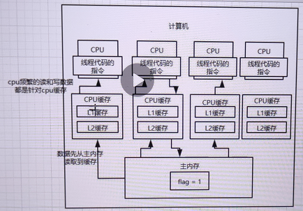
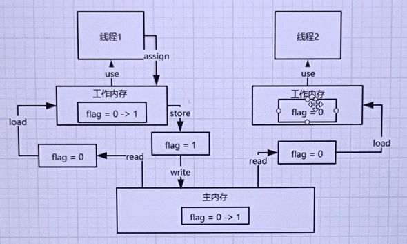

### 1.守护线程
守护线程不会阻止JVM退出,当所有的工作线程都结束后,JVM正常会退出,daemon线程也会跟着结束.

### 2.ThreadGroup
ThreadGroup就是线程组,可以把一堆线程加入一个线程组里,可以将一堆线程作为一个整体统一的管理和设置.  

在java里,每个线程都有一个父线程的概念,就是在哪个线程里创建这个线程,那么他的父线程就是谁.举例来说,
java都是通过main启动的,那么有一个主要的线程就是main线程.在main线程里启动的线程,父线程就是main线程.  

每个线程都必然属于一个线程组,默认情况下,创建一个线程如果没指定线程组,那么就会属于父线程的线程组,
main线程的线程组就是main ThreadGroup.  

java中线程都是有名字的,默认main线程的名字就是叫main,其他线程的名字一般是叫做Thread-0之类的.  

线程组其实也有父线程组的概念,我们创建线程组的时,如果没有手动指定他的父线程组,那么其实默认的父线程组
就是main线程的线程组

假如把一堆线程放到线程组里去,然后可以统一管理哪些东西?
- enumerate(): 复制线程组里的线程
- activeCount(): 获取线程组里活跃的线程
- getName()、getParent()、list()等等
- interrupt(): 打断所有的线程
- destroy(): 一次性destroy所有的线程

JDK虽然提供了ThreadGroup,一般开发或者是很多的开源项目里,ThreadGroup很少用,如果你要自己封装一堆线程的管理组件,
完全可以自己写

### 3.线程启动过程
- 启动了线程之后就不能再重新启动了,因为启动之后,threadStatus就是非0的状态了,再次调用start方法会判断该状态,
  抛出异常
- 启动线程之后,这个线程就会加入之前处理好的那个线程组中
- 启动一个线程实际上走的是native方法:start0(),会实际的启动一个线程
- 一个线程启动之后就会执行run()方法

### 4.yield
让出CPU执行权.  

如果要用这个方法的,必须在严格的测试环境下做大量的测试,验证在需要的场景下使用了yield方法,
真的可以达到需要的效果.很多人很少可以正确的使用这个yield方法,常见于debug和test场景下的程序.

在这样的一些场景下,他可以复现因为锁争用导致的一些bug.

他也可以用于设计一些并发控制的工具,比如说在java.util.concurrent.locks包下的一些类

### 5.join
调用该方法的线程会等待被join的线程执行完毕后再继续执行.

比如main线程里面如果开启了一个其他线程,main线程就会跟其他线程开始并发的运行,一会执行main线程的代码,
一会儿会执行其他线程的代码.

main线程如果对那个线程调用了join的方法,那么就会导致main线程阻塞住,他会等待其他线程的代码逻辑执行结束,
那个线程执行完毕,main线程才会继续往下走

### 6.interrupt
interrupt打断一个线程,其实是在修改那个线程里的一个interrupt的标志位,打断他以后,
interrupt标志位就会变成true,所以在线程内部可以根据这个标志位来判断是否要继续运行.

如果中断正在sleep、wait、join的线程会导致被中断的线程抛出InterruptedException,
并清除中断标记 

### 7.主内存以及CPU多级缓存模型的实现原理

现代的计算机技术,内存的读写速度没什么突破,cpu如果要频繁的读写主内存的话,会导致性能较差,
计算性能就会低,这样不适应现代计算机技术的发展.

现代的计算机给cpu加了几层缓存,cpu可以直接操作自己对应的高速缓存,不需要直接频繁的跟主内存通信,
这样可以保证cpu的计算的效率非常的高.

主内存的数据会被加载到cpu本地缓存里去,cpu后面会读写自己的缓存.当多线程并发运行的时候,
会导致各个cpu的本地缓存跟主内存没有同步

### 8.总线加锁机制和MESI缓存一致性协议的工作原理
最早的时候用的是总线加锁机制,已经没有人来用了.大概的意思是说,某个cpu如果要读一个数据,会通过一个总线,
对这个数据加一个锁,其他的cpu就没法去读和写这个数据了,只有当这个cpu修改完了以后,
其他cpu可以读到最新的数据.

总线加锁机制效率太差,一旦多个线程出现了对某个共享变量的访问之后,就可能串行化,
多个cpu多线程并发运行的时候,效率很差

现在用MESI缓存一致性协议.cpu嗅探机制

### 9.Java内存模型以及多线程并发问题的发生

Java内存模型是跟cpu缓存模型是类似的,基于cpu缓存模型来建立的java内存模型,
只不过java内存模型是标准化的,屏蔽掉底层不同的计算机的区别.

线程的工作内存和主内存: 
- read: 从主存读取
- load: 将主存读取到的值写入工作内存
- use: 从工作内存读取数据来计算
- assign: 将计算好的值重新赋值到工作内存中
- store: 将工作内存数据写入主存
- write: 将store过去的变量值赋值给主存中的变量

### 10.并发编程中的三大特性:可见性、原子性、有序性
原子性: 保证指令不会受到线程上下文切换的影响.在一个操作中,所有的子操作都是一个整体,
要么同时全部执行,要么同时不执行,且在执行过程中,不能被挂起,直到执行完.

可见性: 保证指令不会受 cpu 缓存的影响.当一个线程修改了线程共享变量的值,
其它线程能够立即得知这个修改.  

有序性: 保证指令不会受 cpu 指令并行优化的影响.指令重排是指在程序执行过程中,
为了提高性能,编译器和CPU可能会对指令进行重新排序,在单线程中这完全没问题,还能提高性能,
而在多线程中却有很多问题,会出现重排后结果不一致问题.为了解决这一问题就会防止指令重排,
采用内存屏障来确保指令不会被重排序.

### 11.基于happens-before原则看volatile如何保证有序性
只要符合happens-before的原则就不能重排,如果不符合这些规则的话,就可以自己排序.

- 程序次序规则: 一个线程内,按照代码顺序,书写在前面的操作先行发生于书写在后面的操作
- 锁定规则: 一个unLock操作先行发生于后面对同一个锁的lock操作
- volatile变量规则: 对一个变量的写操作先行发生于后面对这个变量的读操作.
  volatile变量写,再是读,必须保证是先写再读
- 传递规则: 如果操作A先行发生于操作B,而操作B又先行发生于操作C,则可以得出操作A先行发生于操作C
- 线程启动规则: Thread对象的start()方法先行发生于此线程的每个一个动作
- 线程中断规则: 对线程interrupt()方法的调用先行发生于被中断线程的代码检测到中断事件的发生
- 线程终结规则: 线程中所有的操作都先行发生于线程的终止检测,我们可以通过Thread.join()方法结束、
  Thread.isAlive()的返回值手段检测到线程已经终止执行
- 对象终结规则: 一个对象的初始化完成先行发生于他的finalize()方法的开始

### 12.volatile如何保证可见性、有序性
(1)lock指令
对volatile修饰的变量执行写操作的话,JVM会发送一条lock前缀指令给CPU,CPU在计算完之后会立即将这个
值写回主内存,同时因为有MESI缓存一致性协议,所以各个CPU都会对总线进行嗅探,自己本地缓存中的数据是否
被别人修改,如果发现别人修改了某个缓存的数据,那么CPU就会将自己本地缓存的数据过期掉,然后这个CPU上
执行的线程在读取那个变量的时候,就会从主内存重新加载最新的数据了

lock前缀指令 + MESI缓存一致性协议保证可见性

(2)内存屏障: 禁止重排序
加了volatile的变量可以保证前后的一些代码不会被指令重排.

Load1:
int localVar = this.variable
Load2:
int localVar = this.variable2

LoadLoad屏障:Load1;LoadLoad;Load2.确保Load1数据的装载先于Load2后所有装载指令,
Load1对应的代码和Load2对应的代码是不能指令重排的

Store1:
this.variable = 1
StoreStore屏障
Store2:
this.variable2 = 2

StoreStore屏障:Store1;StoreStore;Store2.确保Store1的数据一定刷回主存,对其他cpu可见,
先于Store2以及后续指令

LoadStore屏障:Load1;LoadStore;Store2.确保Load1指令的数据装载,先于Store2以及后续指令

StoreLoad屏障:Store1;StoreLoad;Load2.确保Store1指令的数据一定刷回主存,对其他cpu可见,
先于Load2以及后续指令的数据装载

对于volatile修改变量的读写操作,都会加入内存屏障.
- 每个volatile写操作前面,加StoreStore屏障,禁止上面的普通写和他重排
- 每个volatile写操作后面,加StoreLoad屏障,禁止跟下面的volatile读/写重排
- 每个volatile读操作后面,加LoadLoad屏障,禁止下面的普通读和volatile读重排
- 每个volatile读操作后面,加LoadStore屏障,禁止下面的普通写和volatile读重排

### 13.synchronized底层原理(jvm指令以及monitor锁)
synchronized底层的原理是跟jvm指令和monitor有关系的.如果用到了synchronized关键字,
在底层编译后的jvm指令中,会有MonitorEnter和MonitorExit两个指令.

monitorenter
// 代码对应的指令
monitorexit

每个对象都有一个关联的monitor,比如一个对象实例就有一个monitor,一个类的Class对象也有一个monitor,
如果要对这个对象加锁,那么必须获取这个对象关联的monitor的lock锁.

monitor里面有一个计数器,从0开始的.如果一个线程要获取monitor的锁,就看看他的计数器是不是0,如果是0的话,
说明没人获取锁,他就可以获取锁了,然后对计数器加1

monitor的锁是支持重入加锁的,如果一个线程第一次synchronized那里获取到了myObject对象的monitor的锁,
计数器加1,然后第二次synchronized那里,会再次获取myObject对象的monitor的锁,这个就是重入加锁了,
然后计数器会再次加1变成2.

这个时候其他的线程在第一次synchronized那里,会发现myObject对象的monitor锁的计数器是大于0的,
意味着被别人加锁了,此时线程就会进入block阻塞状态,等着获取锁.

接着如果出了synchronized修饰的代码片段的范围,就会有一个monitorexit的指令.
此时获取锁的线程就会对那个对象的monitor的计数器减1,如果有多次重入加锁就会对应多次减1,直到最后计数器是0,
然后后面block住阻塞的线程，会再次尝试获取锁，但是只有一个线程可以获取到锁

### 14.wait与sleep的区别
- wait会释放锁,sleep不会释放锁
- wait必须通过notify唤醒或者wait(timeout)阻塞一段时间后自己唤醒继续争抢锁
- wait与notify,必须在synchronized代码块中使用,因为必须是拥有monitor lock的线程才可以执行
  wait与notify操作.因此wait与notify必须与synchronized一起对同一个对象使用,她们的monitor才是一样的

