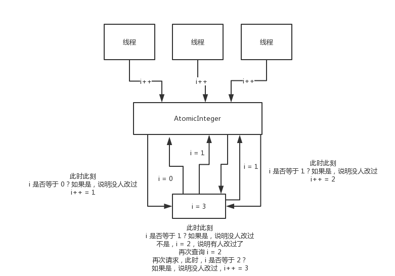
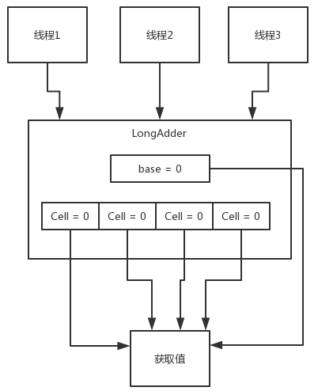
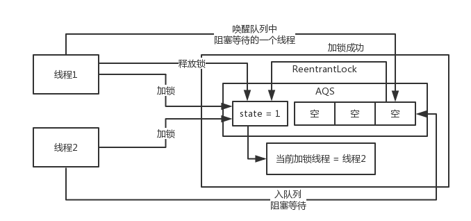
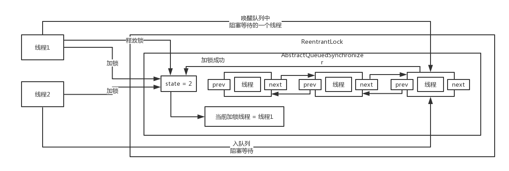

### 1.守护线程
守护线程不会阻止JVM退出,当所有的工作线程都结束后,JVM正常会退出,daemon线程也会跟着结束.

### 2.ThreadGroup
ThreadGroup就是线程组,可以把一堆线程加入一个线程组里,可以将一堆线程作为一个整体统一的管理和设置.  

在java里,每个线程都有一个父线程的概念,就是在哪个线程里创建这个线程,那么他的父线程就是谁.举例来说,
java都是通过main启动的,那么有一个主要的线程就是main线程.在main线程里启动的线程,父线程就是main线程.  

每个线程都必然属于一个线程组,默认情况下,创建一个线程如果没指定线程组,那么就会属于父线程的线程组,
main线程的线程组就是main ThreadGroup.  

java中线程都是有名字的,默认main线程的名字就是叫main,其他线程的名字一般是叫做Thread-0之类的.  

线程组其实也有父线程组的概念,我们创建线程组的时,如果没有手动指定他的父线程组,那么其实默认的父线程组
就是main线程的线程组

假如把一堆线程放到线程组里去,然后可以统一管理哪些东西?
- enumerate(): 复制线程组里的线程
- activeCount(): 获取线程组里活跃的线程
- getName()、getParent()、list()等等
- interrupt(): 打断所有的线程
- destroy(): 一次性destroy所有的线程

JDK虽然提供了ThreadGroup,一般开发或者是很多的开源项目里,ThreadGroup很少用,如果你要自己封装一堆线程的管理组件,
完全可以自己写

### 3.线程启动过程
- 启动了线程之后就不能再重新启动了,因为启动之后,threadStatus就是非0的状态了,再次调用start方法会判断该状态,
  抛出异常
- 启动线程之后,这个线程就会加入之前处理好的那个线程组中
- 启动一个线程实际上走的是native方法:start0(),会实际的启动一个线程
- 一个线程启动之后就会执行run()方法

### 4.yield
让出CPU执行权.  

如果要用这个方法的,必须在严格的测试环境下做大量的测试,验证在需要的场景下使用了yield方法,
真的可以达到需要的效果.很多人很少可以正确的使用这个yield方法,常见于debug和test场景下的程序.

在这样的一些场景下,他可以复现因为锁争用导致的一些bug.

他也可以用于设计一些并发控制的工具,比如说在java.util.concurrent.locks包下的一些类

### 5.join
调用该方法的线程会等待被join的线程执行完毕后再继续执行.

比如main线程里面如果开启了一个其他线程,main线程就会跟其他线程开始并发的运行,一会执行main线程的代码,
一会儿会执行其他线程的代码.

main线程如果对那个线程调用了join的方法,那么就会导致main线程阻塞住,他会等待其他线程的代码逻辑执行结束,
那个线程执行完毕,main线程才会继续往下走

### 6.interrupt
interrupt打断一个线程,其实是在修改那个线程里的一个interrupt的标志位,打断他以后,
interrupt标志位就会变成true,所以在线程内部可以根据这个标志位来判断是否要继续运行.

如果中断正在sleep、wait、join的线程会导致被中断的线程抛出InterruptedException,
并清除中断标记 

### 7.主内存以及CPU多级缓存模型的实现原理


现代的计算机技术,内存的读写速度没什么突破,cpu如果要频繁的读写主内存的话,会导致性能较差,
计算性能就会低,这样不适应现代计算机技术的发展.

现代的计算机给cpu加了几层缓存,cpu可以直接操作自己对应的高速缓存,不需要直接频繁的跟主内存通信,
这样可以保证cpu的计算的效率非常的高.

主内存的数据会被加载到cpu本地缓存里去,cpu后面会读写自己的缓存.当多线程并发运行的时候,
会导致各个cpu的本地缓存跟主内存没有同步

### 8.总线加锁机制和MESI缓存一致性协议的工作原理
最早的时候用的是总线加锁机制,已经没有人来用了.大概的意思是说,某个cpu如果要读一个数据,会通过一个总线,
对这个数据加一个锁,其他的cpu就没法去读和写这个数据了,只有当这个cpu修改完了以后,
其他cpu可以读到最新的数据.

总线加锁机制效率太差,一旦多个线程出现了对某个共享变量的访问之后,就可能串行化,
多个cpu多线程并发运行的时候,效率很差

现在用MESI缓存一致性协议.cpu嗅探机制

### 9.Java内存模型以及多线程并发问题的发生


Java内存模型是跟cpu缓存模型是类似的,基于cpu缓存模型来建立的java内存模型,
只不过java内存模型是标准化的,屏蔽掉底层不同的计算机的区别.

线程的工作内存和主内存: 
- read: 从主存读取
- load: 将主存读取到的值写入工作内存
- use: 从工作内存读取数据来计算
- assign: 将计算好的值重新赋值到工作内存中
- store: 将工作内存数据写入主存
- write: 将store过去的变量值赋值给主存中的变量

### 10.并发编程中的三大特性:可见性、原子性、有序性
原子性: 保证指令不会受到线程上下文切换的影响.在一个操作中,所有的子操作都是一个整体,
要么同时全部执行,要么同时不执行,且在执行过程中,不能被挂起,直到执行完.

可见性: 保证指令不会受 cpu 缓存的影响.当一个线程修改了线程共享变量的值,
其它线程能够立即得知这个修改.  

有序性: 保证指令不会受 cpu 指令并行优化的影响.指令重排是指在程序执行过程中,
为了提高性能,编译器和CPU可能会对指令进行重新排序,在单线程中这完全没问题,还能提高性能,
而在多线程中却有很多问题,会出现重排后结果不一致问题.为了解决这一问题就会防止指令重排,
采用内存屏障来确保指令不会被重排序.

### 11.基于happens-before原则看volatile如何保证有序性
只要符合happens-before的原则就不能重排,如果不符合这些规则的话,就可以自己排序.

- 程序次序规则: 一个线程内,按照代码顺序,书写在前面的操作先行发生于书写在后面的操作
- 锁定规则: 一个unLock操作先行发生于后面对同一个锁的lock操作
- volatile变量规则: 对一个变量的写操作先行发生于后面对这个变量的读操作.
  volatile变量写,再是读,必须保证是先写再读
- 传递规则: 如果操作A先行发生于操作B,而操作B又先行发生于操作C,则可以得出操作A先行发生于操作C
- 线程启动规则: Thread对象的start()方法先行发生于此线程的每个一个动作
- 线程中断规则: 对线程interrupt()方法的调用先行发生于被中断线程的代码检测到中断事件的发生
- 线程终结规则: 线程中所有的操作都先行发生于线程的终止检测,我们可以通过Thread.join()方法结束、
  Thread.isAlive()的返回值手段检测到线程已经终止执行
- 对象终结规则: 一个对象的初始化完成先行发生于他的finalize()方法的开始

### 12.volatile如何保证可见性、有序性
(1)lock指令
对volatile修饰的变量执行写操作的话,JVM会发送一条lock前缀指令给CPU,CPU在计算完之后会立即将这个
值写回主内存,同时因为有MESI缓存一致性协议,所以各个CPU都会对总线进行嗅探,自己本地缓存中的数据是否
被别人修改,如果发现别人修改了某个缓存的数据,那么CPU就会将自己本地缓存的数据过期掉,然后这个CPU上
执行的线程在读取那个变量的时候,就会从主内存重新加载最新的数据了

lock前缀指令 + MESI缓存一致性协议保证可见性

(2)内存屏障: 禁止重排序
加了volatile的变量可以保证前后的一些代码不会被指令重排.

Load1:
int localVar = this.variable
Load2:
int localVar = this.variable2

LoadLoad屏障:Load1;LoadLoad;Load2.确保Load1数据的装载先于Load2后所有装载指令,
Load1对应的代码和Load2对应的代码是不能指令重排的

Store1:
this.variable = 1
StoreStore屏障
Store2:
this.variable2 = 2

StoreStore屏障:Store1;StoreStore;Store2.确保Store1的数据一定刷回主存,对其他cpu可见,
先于Store2以及后续指令

LoadStore屏障:Load1;LoadStore;Store2.确保Load1指令的数据装载,先于Store2以及后续指令

StoreLoad屏障:Store1;StoreLoad;Load2.确保Store1指令的数据一定刷回主存,对其他cpu可见,
先于Load2以及后续指令的数据装载

对于volatile修改变量的读写操作,都会加入内存屏障.
- 每个volatile写操作前面,加StoreStore屏障,禁止上面的普通写和他重排
- 每个volatile写操作后面,加StoreLoad屏障,禁止跟下面的volatile读/写重排
- 每个volatile读操作后面,加LoadLoad屏障,禁止下面的普通读和volatile读重排
- 每个volatile读操作后面,加LoadStore屏障,禁止下面的普通写和volatile读重排

### 13.synchronized底层原理(jvm指令以及monitor锁)
synchronized底层的原理是跟jvm指令和monitor有关系的.如果用到了synchronized关键字,
在底层编译后的jvm指令中,会有MonitorEnter和MonitorExit两个指令.

monitorenter
// 代码对应的指令
monitorexit

每个对象都有一个关联的monitor,比如一个对象实例就有一个monitor,一个类的Class对象也有一个monitor,
如果要对这个对象加锁,那么必须获取这个对象关联的monitor的lock锁.

monitor里面有一个计数器,从0开始的.如果一个线程要获取monitor的锁,就看看他的计数器是不是0,如果是0的话,
说明没人获取锁,他就可以获取锁了,然后对计数器加1

monitor的锁是支持重入加锁的,如果一个线程第一次synchronized那里获取到了myObject对象的monitor的锁,
计数器加1,然后第二次synchronized那里,会再次获取myObject对象的monitor的锁,这个就是重入加锁了,
然后计数器会再次加1变成2.

这个时候其他的线程在第一次synchronized那里,会发现myObject对象的monitor锁的计数器是大于0的,
意味着被别人加锁了,此时线程就会进入block阻塞状态,等着获取锁.

接着如果出了synchronized修饰的代码片段的范围,就会有一个monitorexit的指令.
此时获取锁的线程就会对那个对象的monitor的计数器减1,如果有多次重入加锁就会对应多次减1,直到最后计数器是0,
然后后面block住阻塞的线程，会再次尝试获取锁，但是只有一个线程可以获取到锁

### 14.wait与sleep的区别
- wait会释放锁,sleep不会释放锁
- wait必须通过notify唤醒或者wait(timeout)阻塞一段时间后自己唤醒继续争抢锁
- wait与notify,必须在synchronized代码块中使用,因为必须是拥有monitor lock的线程才可以执行
  wait与notify操作.因此wait与notify必须与synchronized一起对同一个对象使用,她们的monitor才是一样的

### 15.AtomicInteger中的CAS无锁化原理和思路介绍



CAS操作包含三个操作数:内存中的值(V)、预期原值(A)和新值(B).如果内存位置的值与预期原值相匹配,
那么处理器会自动将该位置值更新为新值.否则处理器不做任何操作

### 16.AtomicInteger源码剖析
###### 1.仅限JDK内部使用的Unsafe类
Unsafe类是JDK底层的一个类,限制了不允许外部实例化以及使用他里面的方法.首先构造函数是私有化,不能手动去实例化.
其次如果用Unsafe.getUnsafe()方法来获取一个实例是不行的,他会判断如果当前是属于用户的应用系统,
识别到有外部系统的类加载器以后就会报错,不让外部来获取实例

JDK源码里面,JDK自己内部来使用,不是对外的.

Unsafe封装了一些不安全的操作,指针相关的一些操作,Atomic原子类底层大量的运用了Unsafe
(1)内部变量value使用volatile修饰
(2)Unsafe: 核心类,负责执行CAS操作
(3)API接口:Atomic原子类的各种使用方式

###### 2.无限重复循环以及CAS操作
```
private static final long valueOffset;
private volatile int value;

static {
    try {
        valueOffset = unsafe.objectFieldOffset
            (AtomicInteger.class.getDeclaredField("value"));
    } catch (Exception ex) { throw new Error(ex); }
}
```
类初始化的时候执行的.valueOffset是value这个字段在AtomicInteger这个类中的偏移量,无论是在磁盘的.class文件里还是在JVM内存中,
在底层这个类是有自己对应的结构的.大概可以理解为:value这个字段具体是在AtomicInteger这个类的哪个位置,offset偏移量是很底层的操作,
是通过unsafe来实现的.刚刚在类初始化的时候,就会完成这个操作的,并且是final的,一旦初始化完毕就不会再变更了

```
AtomicInteger.class:
public final int incrementAndGet() {
    return unsafe.getAndAddInt(this, valueOffset, 1) + 1;
}
    
Unsafe.class:
public final int getAndAddInt(AtomicInteger atomicInteger, long valueOffset, int newValue) {
    int currentVal;
    do {
        /**
         * 先根据valueOffset偏移量,就知道value这个字段的位置,可以获取到当前value的值
         */
        currentVal = this.getIntVolatile(atomicInteger, valueOffset);
    } while(!this.compareAndSwapInt(atomicInteger, valueOffset, currentVal, currentVal + newValue));

    return fromMemeryVal;
}
```
 compareAndSwapInt()是CAS方法,会拿刚刚获取到的那个currentVal的值作为当前的value的值,
 去跟当前AtomicInteger对象实例中的value的值去进行比较,这就是compare的过程.
 如果是一样的话就会set,也就是将value的值给设置为:currentVal(之前拿到的值) + 1(递增的值).
 如果currentVal(获取到的值)跟AtomicInteger中获取到的当前的值不一样的话,compareAndSwapInt方法就会返回false,
 while循环里拿到的是false的话,就会自动进入下一轮的循环.如果成功的话会返回一个currentVal的值,
 是递增1之前的一个旧的值,所以会在外层方法中加1返回,告诉你当前累加1之后最新的值

###### 3.底层CPU指令是如何实现CAS语义的
用了一个native方法,可以通过发送一些cpu的指令,确保CAS过程绝对是原子的,具体是怎么来实现呢?
以前的cpu会通过一些指令来锁掉某一小块的内存,后来会做了一些优化,可以保证仅仅只有一个线程在
同一时间可以对某块小内存中的数据做CAS的操作

compare -> set,这是一系列的步骤.在执行这个步骤的时候,每个线程都是原子的,
有一个线程在执行CAS一系列的比较和设置的过程中其他的线程是不能来执行的

- cpu指令来实现
- cpu会通过一些轻量级的锁小块内存的机制来实现

### 17.Atomic原子类体系的CAS语义存在的三大缺点分析
- 1、ABA问题:如果某个值一开始是A,后来变成了B,然后又变成了A,本来期望的是值如果是第一个A才会设置新值,
  结果第二个A一比较也ok,也设置了新值,跟期望是不符合的.所以atomic包里有AtomicStampedReference类,
  就是会比较两个值的引用是否一致,一致才会设置新值

假设一开始变量i = 1,先获取这个i的值是1,然后累加了1变成了2,但是在此期间别的线程将i -> 1 -> 2 -> 3 -> 1,
这个期间这个值是被改过的,只不过最后将这个值改成了最初的那个值,后来去compareAndSet的时候,会发现这个i还是1,
就将它设置成了2,设置成功了

实际使用中,用AtomicInteger常见的是计数,所以说一般是不断累加的,所以ABA问题比较少见

ABA的危害:https://www.cnblogs.com/yingying7/p/12573240.html

- 2、无限循环问题:看源码就知道Atomic类设置值的时候会进入一个无限循环,只要不成功就不停循环再次尝试,导致CPU很高.
  这个在高并发修改一个值的时候其实挺常见的,比如用AtomicInteger在内存里搞一个原子变量,然后高并发下多线程频繁修改,
  其实可能会导致这个compareAndSet()里要循环N次才设置成功,所以还是要考虑到的

JDK 1.8引入的LongAdder来解决,分段CAS思路

- 3、多变量原子问题:一般的AtomicInteger只能保证一个变量的原子性,但是如果多个变量呢?
  可以用AtomicReference,这个是封装自定义对象的,多个变量可以放一个自定义对象里,会检查这个对象的引用是不是一个

### 18.J8 LongAdder是如何通过分段CAS机制优化多线程自旋问题的



Java 8提供的一个对AtomicLong改进后的一个类:LongAdder.

大量线程并发更新一个原子类的时候,天然的一个问题就是自旋,会导致并发性能还是有待提升.对于LongAdder,当大量线程并发更新的时候,
会将对base的自旋拆分成多个Cell,多个线程分散到多个Cell上进行自旋.并且LongAdder采用分段迁移,当某一个线程对一个Cell更新的时候,
发现很难更新他的值,出现了多次自旋的问题,如果他CAS失败了,自动迁移段,去尝试更新别的Cell的值,这样的话就可以让一个线程不会盲目的
等待一个cell的值

当需要get LongAdder的值的时候会将各个cell的值和base的值累加到一起返回.

### 19.AQS
AQS:AbstractQueuedSynchronizer,抽象队列同步器,是java并发包各种并发工具(锁、同步器)的底层的基础性的组件.AQS里关键的一些东西,
一个是Node(自定义数据结构,可以组成一个双向链表,也就是所谓的一个队列),state(核心变量,加锁、释放锁都是基于state来完成的,CAS)

ReentrantLock、ReadWriteReentrantLock,锁API底层都是基于AQS来实现的,一般不直接使用,但是是属于java并发包里的底层的API,
专门支撑各种java并发类的底层的逻辑实现




可以认为AQS中有一个state状态、一个线程等待的队列、当前加锁线程的标记
1.当线程1利用ReentrantLock加锁时,会通过CAS将state状态修改为1,同时将独占锁exclusiveOwnerThread(AbstractOwnableSynchronizer)
设置为当前线程.PS:会利用state和exclusiveOwnerThread判断是否是重入过程
2.假设线程1还没释放锁,线程2也过来加锁,获取到状态为1,加锁失败,线程2会进入队列等待
3.当线程1释放锁以后,会将状态改为0,将当前加锁线程标记为空,同时唤醒队列中等待的一个线程.
4.当线程2被唤醒以后回去尝试加锁,此时就和线程1第一次加锁的过程一样了

### 20.AQS的本质:为啥叫异步队列同步器



### 21.ReentrantReadWriteLock
ReentrantLock比较少用,和synchronized差不多.JDK 1.6以后,synchronized底层实现也是做一些计数器的维护来实现加锁释放锁,CAS

如果需要用synchronized话,优先使用.真正开发或者开源项目其实都是用的synchronized.

读写锁ReentrantReadWriteLock:

Lock API,读写锁,可以加读锁,也可以加写锁.但是读锁和写锁是互斥的,也就是说加了读锁之后就不能加写锁;如果加了写锁就不能加读锁.

加了读锁之后可以同时加读锁.

如果有一份数据有人读有人写,如果全部都是用synchronized的话,会导致如果多个人读也是要串行化.希望的效果是多个线程可以同时来读,
如果使用读锁和写锁分开的方式,就可以让多个线程来读数据,多个线程可以同时加读锁.

如果有线程在读数据,就不能有线程数据,读锁 -> 写锁 -> 互斥.

如果有线程在写数据,其他线程不能写数据,写锁 -> 写锁 -> 互斥.

如果有线程在写数据,其它线程也不能读数据,写锁 -> 读锁 > 互斥

### 22.锁优化策略
- 标志位修改等可见性场景优先使用volatile:如果仅仅只是有一些线程会来写一个变量,另外一个线程是来读取这个变量的值,优先使用volatile
- 数值递增场景优先使用Atomic原子类
- 数据允许多副本场景优先使用ThreadLocal
- 读多写少需要加锁的场景优先使用读写锁
- 尽可能减少线程对锁占用的时间:如果读写锁用不了必须使用synchronized锁,那么加锁有一个核心点,尽量保证你加锁的时间是很短的,
  不要在加锁之后执行一些磁盘文件读写、网络IO读写,导致锁占用的时间过于长.一般来说建议加锁尽量就是操作一下内存里的数据,
  不要在锁里面去执行一些耗时的一些操作,比如执行数据库操作或者是别的一些东西,可能会导致占用锁的时间
- 尽可能减少线程对数据加锁的粒度:1.分段加锁,尽可能的减少一个线程占用锁的时间;2.尽可能减少对数据加锁的粒度.比方说有一份数据,
  里面包含了多个子数据,可以对一整块完整的大数据来加锁,只要访问这一大块数据都会有锁的争用的问题.也可以选择降低加锁的粒度,
  仅仅对大块数据里的部分子数据加锁.如果别的线程去请求这个大块数据里其他的子数据的话,就不会产生锁冲突.说白了就是对更少的数据
  或者是对更少的代码进行加锁
- 尽可能对不同功能分离锁的使用:如果可能的话,看看能不能按照这个功能的不同,拆分为两把锁,在使用不同的功能的时候,可以用不同的锁,
  这样降低线程竞争锁的冲突.比如阻塞队列就使用了两把锁,队头是一把锁,队列尾巴是一把锁,从队列尾巴插进去是加的一把锁,
  从队头消费数据使用的是另外一把锁,入队和出队的操作就不会因为锁产生冲突了
- 避免在循环中频繁的加锁以及释放锁
- 尽量减少高并发场景中线程对锁的争用:1.减少锁占用的时间;2.数据的分段加锁;3.减少线程对锁的抢占和争用的频率.微服务注册中心,
  完全可以用这个策略来进一步的优化服务注册表的并发冲突问题.读写锁主要是解决了大量的读请求不会串行化,读请求可以并发起来,
  但是写锁和读锁还是会冲突,如果有服务实例注册、下线,写锁此时还是会短暂的影响读注册表的数据,读锁是加不上的.eureka多级缓存架构和机制,
  使用了ReadOnlyMap,ReadWriteMap.读请求全部从ReadOnlyMap走,如果这一级缓存里没有则从ReadWriteMap里找,如果也没有,
  则从服务注册表来加载.ReadOnlyMap,大量的线程并发的读服务注册表的数据是不需要加锁的.只有在ReadOnlyMap里面没数据的时候,
  此时会加一个synchronized锁,只有一个线程可以去找ReadWriteMap,去找服务注册表的数据,此时会加服务注册表的读锁,但是找到了书数据,
  填充完了两级缓存之后,释放synchronized锁,前面的线程又可以直接读缓存里的数据.这样就将服务注册表的读锁降低到了很少的频率.
  某个线程发现缓存里没数据,要直接读服务注册表的数据的时候才会加读锁.如果更新数据之后,此时会过期掉ReadWriteMap,
  有一个后台线程会隔30秒后,去过期掉ReadOnlyMap里的数据,此时缓存清空


